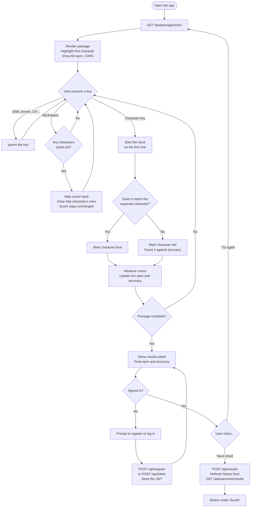

# User Flow

The interactions a user can have with the typing app, as implemented in
`frontend/src/hooks/useTyping.ts` and `frontend/src/App.tsx`.

## States

| State    | What the user sees                                                                                          |
| -------- | ----------------------------------------------------------------------------------------------------------- |
| Ready    | A passage fetched from the API, first character highlighted. Stats seeded at 60 wpm / 100%. Nothing is timed yet. |
| Typing   | Characters color as correct or wrong, live wpm and accuracy update on every keystroke.                      |
| Finished | Results panel appears with final wpm and accuracy. Typing is ignored.                                       |

The clock starts on the **first character key**, not on page load — so
stats reflect typing time, not thinking time.

**Typing does not require an account.** The passage loads and the engine runs
whether or not you are signed in. Only *saving* a score needs one.

## Diagram

## Interaction notes

- **Wrong keys still advance.** A mistyped character moves the cursor forward
  and marks the character red. The user chooses whether to backspace and fix
  it.
- **Backspace clears color but not the score.** The `typed` and `wrong`
  counters only ever increase, so correcting a mistake restores the passage's
  appearance but not the accuracy lost. This is deliberate — it keeps accuracy
  honest.
- **Saving is idempotent per run.** The Save button disables itself once the
  run is stored, so a run cannot be double-counted. (The vanilla app appended a
  duplicate on every click.)
- **Try again fetches a new passage** from the API rather than reloading the
  page, so the session survives.
- **Scores are owned by the token, not the request.** The server takes the user
  from the JWT, so a client cannot write a score into someone else's history.
- **Scrolling is currently inert.** The passages are ~95 characters and fit
  inside the viewport, so there is no overflow to scroll. The animation loop
  runs correctly; longer passages would scroll.
