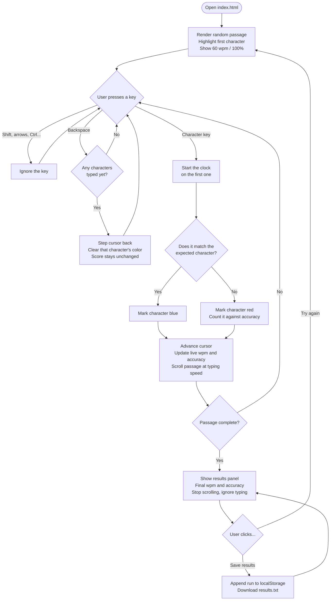

# User Flow

The interactions a user can have with the typing game, as implemented in
`app.js`.

## States

| State    | What the user sees                                                                                          |
| -------- | ----------------------------------------------------------------------------------------------------------- |
| Ready    | Passage rendered, first character highlighted. Stats seeded at 60 wpm / 100%. Nothing is timed yet.         |
| Typing   | Characters color as correct or wrong, the passage scrolls, live wpm and accuracy update on every keystroke. |
| Finished | Results panel appears with final wpm and accuracy. Typing is ignored; scrolling stops.                      |

The clock starts on the **first character key**, not on page load — so
stats reflect typing time, not thinking time.

## Diagram

## Interaction notes

- **Wrong keys still advance.** A mistyped character moves the cursor forward
  and marks the character red. The user chooses whether to backspace and fix
  it.
- **Backspace clears color but not the score.** The `typed` and `wrong`
  counters only ever increase, so correcting a mistake restores the passage's
  appearance but not the accuracy lost. This is deliberate — it keeps accuracy
  honest.
- **Save results is repeatable.** Each click appends the current run to the
  running history in `localStorage` and re-downloads the full `results.txt`,
  so clicking twice records the run twice.
- **Try again reloads the page**, which picks a new random passage and resets
  all counters.
